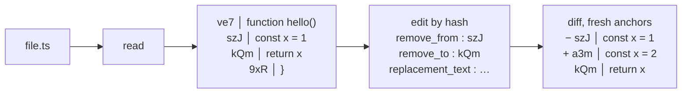
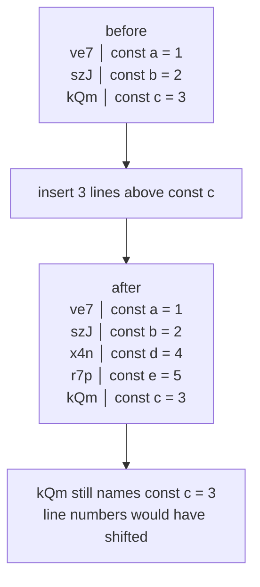

# dsh-better-edit

[English](README.md) · [中文](README.zh.md)

Hash-anchored `read` / `edit` / `batch_edit` / `undo_last_edit` tools for
[DeepSeek Harness](https://github.com/deepseek-ai/deepseek-harness) (`dsh`).
Every line of a file gets a unique 3-character hash — a **content address** —
and you edit by hash. No line numbers, no fuzzy matching, no edits landing on
the wrong line.

Three things this plugin is built around:

- **Token-saving.** An edit call carries `remove_from` / `remove_to` (two
  3-char hashes) plus the replacement text — it never echoes the text being
  replaced. A `str_replace` call must reproduce that text verbatim. On a
  12-edit session over a realistic file this is **28% fewer output tokens**
  (40% on multi-line ranges) — see the [benchmark](#benchmark--reproducible).
- **Correctness.** Every resolved edit range is verified against the exact
  lines the model was shown. A stale, never-served, or ambiguous range is
  hard-rejected **before anything is written**, and the current range is
  echoed back as fresh anchors (reject-and-serve). Wrong-line edits cannot
  silently land.
- **A modern edit pattern for agents.** Content-addressed anchors are
  line-number-agnostic: edit one part of a file and the hashes of the rest
  stay put, so chained edits need no re-reads. The model pins a line by what
  it *is*, not by where it used to sit.

## Core concepts



- **Every line is addressed by its content, not its position.** `read`
  returns `HASH│content`; the hash is a stable address for that line. Change
  the line and it gets a new hash; leave it alone and it keeps the hash even
  as the lines around it move.



- **Anchors survive edits.** Insert or delete lines above a target and its
  hash is unchanged — a later `edit` by that hash still lands on it. With
  line numbers, every edit above shifts everything below and forces a
  re-read.
- **Reject-and-serve.** A stale or never-served range is hard-rejected with
  the current `HASH│content` rows echoed back, so the retry needs no `read`.

## Why not `str_replace`?

Traditional edit tools ask the model to echo the old code token-for-token
before stating the replacement (`old_string` + `new_string`). That costs
`O(replaced text)` tokens per edit **and** is where models fail: the original
[harness-problem](https://stencil.so/blog/the-harness-problem) post reported
patch-format failure rates of 46–51% for several models with replace-style
edits, and a **61% output-token reduction** after switching to anchored
edits. hashline sends two 3-char anchors instead:

| | `str_replace` | hashline `edit` |
| --- | --- | --- |
| request | `{ path, old_string, new_string }` | `{ path, remove_from, remove_to, replacement_text }` |
| replaced text | reproduced verbatim | never sent |
| range verification | none (first match wins) | every line checked against served state |
| stale file | old_string may still match — and hit the wrong occurrence | rejected with fresh anchors (`E_RANGE_STALE`) |
| ambiguous text | first occurrence, silently | boundary anchors verified — call `read` for fresh anchors |

## Benchmark — reproducible

`benchmark/run.mjs` measures the model-side token cost of the two patterns on
the same 103-line file with the same 12 replacements (8 single-line, 4
multi-line of 3/6/10/15 lines), tokenized with the pinned `js-tiktoken`
`cl100k_base`:

| scenario | lines | hashline | str_replace | saved | % |
| --- | --- | --- | --- | --- | --- |
| single-line ×8 | 1 | 311 | 314 | 3 | 1% |
| multi-line ×4 | 3–15 | 390 | 655 | 265 | **40%** |
| **TOTAL ×12** | | **701** | **969** | **268** | **28%** |

Read traffic is identical for both tools and cancels. These are the model's
**output** tokens, billed at ~5-6× the input rate — at the 5× rate, hashline
costs **~1.4× less** on effective cost. Savings scale with the replaced text:
near parity on short single lines (the anchors' overhead roughly cancels a
one-line `old_string`), 25–46% on multi-line ranges.

Reproduce it yourself — deterministic, self-checking, no build step:

```sh
npm install        # installs js-tiktoken (pinned)
npm run benchmark  # node benchmark/run.mjs
```

Full methodology, results, and honest limitations (what the baseline does and
doesn't model) are in [`benchmark/README.md`](benchmark/README.md).

## Usage

1. Read a file:

```text
ve7│function hello() {
szJ│  console.log("world");
kQm│}
```

1. Edit a line by its hash:

```json
{
  "path": "src/main.ts",
  "remove_from": "szJ",
  "remove_to": "szJ",
  "replacement_text": "  console.log('hi');"
}
```

1. Keep editing. Anchors for lines you didn't touch stay valid; the post-edit
   diff and the auto-read after `write` hand you fresh anchors. A `read` is
   on-demand recovery, not a per-edit ritual.

### The read tool

`read` returns a text file with every line prefixed by `HASH│content` (hash =
3 chars from `A-Za-z0-9`). Parameters: `offset` (1-based start line), `limit`
(maximum lines). Paged output ends with `[Showing lines N-M of T. Use
offset=… to continue.]`. Lines larger than 200KB are shown as a marker with a
`sed` inspection hint — hash anchors need full lines.

### The edit tool

| Field | Meaning |
| --- | --- |
| `path` | Path to edit (relative to the session cwd; absolute works). |
| `remove_from` | Bare 3-char hash of the first line to remove. |
| `remove_to` | Bare 3-char hash of the last line to remove. |
| `replacement_text` | Replacement text; `""` deletes the range. |

The tool verifies **every line** of the resolved range against what the model
was actually shown. A line inside the range that changed on disk since it was
served is hard-rejected with `[E_RANGE_STALE]` / `[E_RANGE_UNSERVED]` /
`[E_RANGE_UNVERIFIED]`, and the current range is echoed back as fresh anchors
(reject-and-serve). Anchors for lines outside the post-edit diff window are
recovered with a `read` — that is the documented on-demand recovery.

### batch_edit

Several edits in one atomic call: `{ edits: [{ path?, remove_from,
remove_to, replacement_text }, …] }`. All-or-nothing — any failing item
rejects the whole batch with nothing written, and the failing item's current
range is echoed as fresh serves. Up to 32 items.

### undo_last_edit

`{ path }` reverts the last hashline edit on the file, only while the file
still matches the stored post-edit content. A later external write clears the
history instead of being overwritten. Undo survives restarts (stored in the
hash store).

## How it replaces the built-in tools

dsh's tool registry resolves per scope: an agent sees `agent → preset →
global`, and its **own** layer always wins. The built-in `read`/`edit` live on
the agent-preset layer, so a plain global registration cannot replace them.
This plugin:

1. Mounts as a host-plane Cordis plugin via its `cordis.patch.yml` bundle
   patch.
2. On `agent/session-start`, registers the hashline tools **and** the
   `tool:read` / `tool:edit` prompt sections on the agent's own scope layer —
   they shadow the preset's built-ins for that agent and unwind automatically
   when the agent is disposed.
3. Leaves the built-in `write` in place, but a scoped `tools/post-execute`
   listener appends the hashline auto-read to write results.

## Installation

From npm:

```sh
dsh plugin --profile <name> add dsh-better-edit
```

From a local checkout:

```sh
dsh plugin --profile <name> add /path/to/dsh-better-edit
```

The profile's next session runs with the hashline tools installed. To verify
the layer is active:

```sh
dsh --profile <name> --dump-config   # shows a "# == dsh-better-edit" layer
```

### Requirements

- Node `^22.19.0 || >=24.0.0` (dsh's requirement; the store uses `node:sqlite`)
- A dsh profile (`dsh plugin` initializes one on first use)

## Store

Hash snapshots, served-state rows, and undo history live in one SQLite store
**co-located with the workspace being edited** — one store per session cwd:

- `<workspace>/.dsh_better_edit/hash-store.sqlite`

Parallel sessions in different workspaces keep separate stores (the session
cwd is carried through each tool call), so one project's anchors and undo
history never leak into another's. Outside a tool call (tests, previews) the
store falls back to the shared DeepSeek Harness home
(`$DSH_HOME/plugins/dsh-better-edit/hash-store.sqlite`).

A 7-day TTL prunes served rows; missing-file snapshots are pruned at startup.
Corrupt stores are quarantined and rebuilt automatically. Moving to the
per-workspace layout does not migrate earlier undo history from the shared
home — treat any pre-0.1.2 undo entries as gone.

## Error codes

| Code | Meaning |
| --- | --- |
| `[E_ACCESS]` | File exists but is not readable/writable by the tool. |
| `[E_AMBIGUOUS_ANCHOR]` | A hash matches more than one current line; call `read` for fresh anchors. |
| `[E_BAD_OP]` | Range end precedes range start (autocorrected when the pair was reversed). |
| `[E_BAD_REF]` | `remove_from`/`remove_to` is not a bare 3-char hash. |
| `[E_BAD_SHAPE]` | Request/field shape is wrong (unknown fields, missing path, non-string text, …). |
| `[E_BARE_HASH_PREFIX]` | `HASH│` prefix pasted into `replacement_text` (autocorrected). |
| `[E_BATCH_ABORT]` | A batch item failed; the whole batch was rejected, nothing written. |
| `[E_FILE_TOO_LARGE]` | File exceeds the hashline line ceiling; use `write` or another approach. |
| `[E_INVALID_PATCH]` | Diff-preview markers pasted into `replacement_text` (autocorrected). |
| `[E_NOOP_LOOP]` | The exact same edit keeps producing no change; resubmitting is rejected. |
| `[E_NOT_FOUND]` | File does not exist. |
| `[E_NOT_OBSERVED]` | The file has not been observed in this session (read-before-write policy); call `read` first. |
| `[E_NOT_TEXT]` | Path is a directory, binary, or non-UTF-8 file; hashline edits only text. |
| `[E_RANGE_STALE]` | A served line differs on disk since it was read; the range is echoed fresh. |
| `[E_RANGE_UNSERVED]` | The range includes lines never served to the model. |
| `[E_RANGE_UNVERIFIED]` | Boundary anchor cannot be verified against served state. |
| `[E_STALE_ANCHOR]` | Anchor(s) no longer resolve; call `read` for fresh anchors. |
| `[E_UNDO_STALE]` | Cannot undo: the file was modified (or deleted) after the edit. |
| `[E_UNDO_UNAVAILABLE]` | Undo history could not be persisted; the edit was not applied. |
| `[E_WOULD_EMPTY]` | An edit would empty a non-empty file; use `write` to clear it. |

## Inspiration and lineage

Hash-anchored editing descends from Can Bölük's
[*The Harness Problem*](https://stencil.so/blog/the-harness-problem), which
showed that the harness — not the model — was the bottleneck, and that
anchored edits beat search-and-replace. This project is a dsh port of:

- [**pi-hashline-edit**](https://github.com/RimuruW/pi-hashline-edit) by
  RimuruW — the original pi-coding-agent extension that introduced
  3-character hashes and collision resolution.
- [**pi-hashline-edit-pro**](https://github.com/YuGiMob/pi-hashline-edit-pro)
  by YuGiMob — the hardened fork the hashline core here is ported from.
- [**pi-hashline-edit-lsz**](https://github.com/Rianico/pi-hashline-edit-lsz) —
  the self-maintained fork this project tracks. The hashline core is ported
  byte-for-byte; the tool layer is rewritten on dsh's plugin API.

Related reading: [Hash anchors + Myers diff + single-token anchors
(dirac.run)](https://dirac.run/posts/hash-anchors-myers-diff-single-token)
(a design review of the O(S+R) → O(R) edit-call saving) and an independent
[hashline-vs-replace benchmark](https://nwyin.com/blogs/hashline-vs-replace-edit-bench.html).

## Development

```sh
npm install
npm run typecheck   # tsc --noEmit
npm test            # vitest run
npm run build       # tsc → lib/
npm run benchmark   # reproducible token-cost benchmark (benchmark/)
```

The test suite is ported from pi-hashline-edit-lsz (615 tests) and drives the
dsh tool builders directly over a local filesystem bridge.

## License

MIT — see [LICENSE](LICENSE). Ported from pi-hashline-edit-lsz (MIT), which
itself carries the upstream copyrights of RimuruW and YuGiMob.
