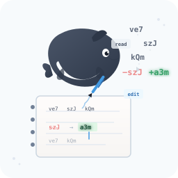
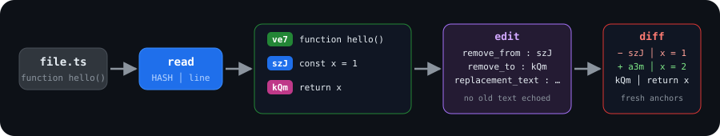

<p align="center">
  
</p>

<h1 align="center">dsh-better-edit</h1>

<p align="center">
  <strong>Hash-anchored edit tools for DeepSeek Harness.<br>
  Edit by content address — not line numbers. Fewer tokens. Zero misapplied edits.</strong>
</p>

<p align="center">
  <strong>English</strong> ·
  <a href="README.zh.md">简体中文</a>
</p>

<p align="center">
  <a href="#quick-start">Quick Start</a> •
  <a href="#why-hashline">Why Hashline</a> •
  <a href="#benchmark">Benchmark</a> •
  <a href="#installation">Installation</a> •
  <a href="#tools">Tools</a> •
  <a href="#acknowledgments">Acknowledgments</a>
</p>

<p align="center">
  
  
  
  
  
  
</p>

<p align="center">
  
</p>

---

> *"The harness — not the model — is the bottleneck."*
> — Can Bölük, [*The Harness Problem*](https://stencil.so/blog/the-harness-problem)

Most edit tools ask the model to echo the old code **token-for-token** before it can change anything
— and that's exactly where agents fail: 46–51% patch-format failure rates for several models with
replace-style edits. **dsh-better-edit** goes deeper. Every line of a file gets a unique 3-character
content hash, and edits target hashes. The old text is never echoed, anchors survive edits, and every
resolved range is verified against exactly what the model saw — wrong-line edits cannot silently land.

## Quick Start

`read` returns every line prefixed by its hash — the hash *is* the line's address:

```text
ve7│function hello() {
szJ│  console.log("world");
kQm│}
```

`edit` targets a range of hashes, so edits always land on the lines you meant:

```json
{
  "path": "src/main.ts",
  "remove_from": "szJ",
  "remove_to": "szJ",
  "replacement_text": "  console.log('hi');"
}
```

and produces a diff with fresh anchors, so the next edit verifies cleanly with no re-read:

```text
− szJ │   console.log("world");
+ a3m │   console.log('hi');
  kQm │ }
```

## Why Hashline

**Token-saving.** An edit call carries `remove_from` / `remove_to` (two 3-char hashes) plus the
replacement text — it never echoes the text being replaced. A `str_replace` call must reproduce that
text verbatim. On a 12-edit session over a realistic file this is **28% fewer output tokens** (40%
on multi-line ranges) — and these are *output* tokens, billed at ~5-6× the input rate. See the
[benchmark](#benchmark).

**Correctness.** Every resolved edit range is verified against the exact lines the model was shown.
A stale, never-served, or ambiguous range is hard-rejected **before anything is written**, and the
current range is echoed back as fresh anchors (reject-and-serve) — the retry needs no `read`.

**A modern edit pattern for agents.** Content-addressed anchors are line-number-agnostic: edit one
part of a file and the hashes of the rest stay put, so chained edits need no re-reads. The model
pins a line by what it *is*, not by where it used to sit.

### How It Compares

| | hashline `edit` | `str_replace` | line-number edit |
| --- | :---: | :---: | :---: |
| Replaced text echoed in the call | ✅ no — 2 hashes | ❌ verbatim | ✅ no |
| Verification against what the model saw | ✅ every line | ❌ first match wins | ~ |
| Stale file detected | ✅ rejects, fresh anchors | ❌ may match wrong spot | ~ |
| Anchors survive edits above | ✅ content-addressed | ✅ content-based | ❌ re-read needed |
| Chained edits without re-reads | ✅ diff serves fresh anchors | ~ | ❌ |
| Unambiguous when text repeats | ✅ boundary anchors verified | ❌ first occurrence | ~ |
| Wrong-line edit can land silently | ❌ impossible | ✅ | ✅ |

> `~` = occasionally / inconsistently. Line-number edit tools accept a line range and apply it to
> whatever is at that offset when the call executes — cheap, but stale the moment anything above
> moves.

## Benchmark

Measured on the same 103-line file with the same 12 replacements (8 single-line, 4 multi-line of
3/6/10/15 lines), tokenized with the pinned `js-tiktoken` `cl100k_base`:

| Criterion | hashline | str_replace |
| ----------- | :---: | :---: |
| Replaced text sent over the wire | ✅ never | ❌ every edit |
| Output tokens saved (12-edit session) | ✅ **28%** | ❌ 0% |
| Multi-line range savings (3–15 lines) | ✅ **25–46%** | ❌ 0% |
| Effective cost at 5× output pricing | ✅ **~1.4× less** | ❌ 1× |
| Ranges verified against served state | ✅ 100% | ❌ none |
| Deterministic, reproducible locally | ✅ `npm run benchmark` | — |

### Reproducible

The numbers above are **deterministic and you can reproduce them locally** — `npm run benchmark`:

| Scenario | Lines | hashline | str_replace | Saved | % |
| --- | :---: | :---: | :---: | :---: | :---: |
| single-line ×8 | 1 | 311 | 314 | 3 | 1% |
| multi-line ×4 | 3–15 | 390 | 655 | 265 | **40%** |
| **TOTAL ×12** | | **701** | **969** | **268** | **28%** |

The script is deterministic by construction: a frozen corpus, a content-addressed edit script that
self-checks (a reformatted corpus throws instead of silently changing what's measured), and a pinned
tokenizer. Because everything is fixed, `npm run benchmark` gives everyone the same result.

> **Scope & honesty.** The benchmark measures **request-payload tokens** — what the model emits per
> edit call — with identical read traffic excluded (it cancels) and identical replacement text.
> It does **not** model transcription failure and retries, which is where the real-world gap is
> largest: the original [harness-problem](https://stencil.so/blog/the-harness-problem) post reported
> a **61% output-token reduction** and patch-failure drops from 46–51% to near zero after switching
> to anchored edits. Full methodology and limitations in
> [`benchmark/README.md`](benchmark/README.md).

## Installation

```sh
dsh plugin --profile <name> add dsh-better-edit   # from npm
dsh plugin --profile <name> add /path/to/dsh-better-edit   # from a local checkout
```

The profile's next session runs with the hashline tools installed. To verify the layer is active:

```sh
dsh --profile <name> --dump-config   # shows a "# == dsh-better-edit" layer
```

| Requirement | |
| --- | --- |
| Node | `^22.19.0 \|\| >=24.0.0` (dsh's requirement; the store uses `node:sqlite`) |
| Profile | a dsh profile (`dsh plugin` initializes one on first use) |
| Backends | sandboxed / remote filesystems supported (writes go through `ctx.fs`) |

## Tools

| Tool | What it does |
| ------ | -------------- |
| `read` | Returns a file with every line as `HASH│content`. Parameters: `offset` (1-based), `limit`. Paged output ends with `[Showing lines N-M of T. Use offset=… to continue.]`. Lines >200KB are shown as a marker with a `sed` hint — hash anchors need full lines. |
| `edit` | Replaces a range of lines by hash. `path` · `remove_from` · `remove_to` · `replacement_text` (`""` deletes). Verifies **every line** of the resolved range against served state; `[E_RANGE_STALE]` / `[E_RANGE_UNSERVED]` / `[E_RANGE_UNVERIFIED]` reject-and-serve fresh anchors. |
| `batch_edit` | Up to 32 edits in one atomic call: `{ edits: [{ path?, remove_from, remove_to, replacement_text }, …] }`. All-or-nothing; the failing item's range is echoed as fresh serves. |
| `undo_last_edit` | `{ path }` reverts the last hashline edit, only while the file still matches the stored post-edit content; survives restarts. |

### Error codes

| Code | Meaning |
| --- | --- |
| `[E_ACCESS]` | File exists but is not readable/writable by the tool. |
| `[E_AMBIGUOUS_ANCHOR]` | A hash matches more than one current line; call `read` for fresh anchors. |
| `[E_BAD_OP]` | Range end precedes range start (autocorrected when the pair was reversed). |
| `[E_BAD_REF]` | `remove_from`/`remove_to` is not a bare 3-char hash. |
| `[E_BAD_SHAPE]` | Request/field shape is wrong (unknown fields, missing path, non-string text, …). |
| `[E_BARE_HASH_PREFIX]` | `HASH│` prefix pasted into `replacement_text` (autocorrected). |
| `[E_BATCH_ABORT]` | A batch item failed; the whole batch was rejected, nothing written. |
| `[E_FILE_TOO_LARGE]` | File exceeds the hashline line ceiling; use `write` or another approach. |
| `[E_INVALID_PATCH]` | Diff-preview markers pasted into `replacement_text` (autocorrected). |
| `[E_NOOP_LOOP]` | The exact same edit keeps producing no change; resubmitting is rejected. |
| `[E_NOT_FOUND]` | File does not exist. |
| `[E_NOT_OBSERVED]` | The file has not been observed in this session (read-before-write policy); call `read` first. |
| `[E_NOT_TEXT]` | Path is a directory, binary, or non-UTF-8 file; hashline edits only text. |
| `[E_RANGE_STALE]` | A served line differs on disk since it was read; the range is echoed fresh. |
| `[E_RANGE_UNSERVED]` | The range includes lines never served to the model. |
| `[E_RANGE_UNVERIFIED]` | Boundary anchor cannot be verified against served state. |
| `[E_STALE_ANCHOR]` | Anchor(s) no longer resolve; call `read` for fresh anchors. |
| `[E_UNDO_STALE]` | Cannot undo: the file was modified (or deleted) after the edit. |
| `[E_UNDO_UNAVAILABLE]` | Undo history could not be persisted; the edit was not applied. |
| `[E_WOULD_EMPTY]` | An edit would empty a non-empty file; use `write` to clear it. |

## How It Replaces the Built-in Tools

dsh's tool registry resolves per scope: an agent sees `agent → preset → global`, and its **own**
layer always wins. The built-in `read`/`edit` live on the agent-preset layer, so a plain global
registration cannot replace them. This plugin:

1. Mounts as a host-plane Cordis plugin via its `cordis.patch.yml` bundle patch.
2. On `agent/session-start`, registers the hashline tools **and** the `tool:read` / `tool:edit`
   prompt sections on the agent's own scope layer — they shadow the preset's built-ins for that
   agent and unwind automatically when the agent is disposed.
3. Leaves the built-in `write` in place, but a scoped `tools/post-execute` listener appends the
   hashline auto-read to write results.

## Store

Hash snapshots, served-state rows, and undo history live in one SQLite store **co-located with the
workspace being edited** — one store per session cwd:

```
<workspace>/.dsh_better_edit/hash-store.sqlite
```

Parallel sessions in different workspaces keep separate stores (the session cwd is carried through
each tool call), so one project's anchors and undo history never leak into another's. Outside a tool
call (tests, previews) the store falls back to the shared DeepSeek Harness home
(`$DSH_HOME/plugins/dsh-better-edit/hash-store.sqlite`).

A 7-day TTL prunes served rows; missing-file snapshots are pruned at startup. Corrupt stores are
quarantined and rebuilt automatically. Moving to the per-workspace layout does not migrate earlier
undo history from the shared home — treat any pre-0.1.2 undo entries as gone.

## Project Structure

```
dsh-better-edit/
├── src/
│   ├── hashline/        # hash + served-state core (ported byte-for-byte from pi-hashline-edit-lsz)
│   ├── tool-read.ts     # read  — HASH│content, offset/limit paging
│   ├── tool-edit.ts     # edit  — range-by-hash, reject-and-serve
│   ├── tool-batch-edit.ts
│   ├── tool-undo.ts     # undo_last_edit
│   ├── sandbox.ts       # FsSandboxController mirror (sandbox_permissions/justification)
│   ├── write-hook.ts    # auto-read appended to write results
│   ├── served-store.ts  # per-workspace SQLite store (node:sqlite)
│   └── workspace.ts     # session-cwd AsyncLocalStorage carrier
├── benchmark/           # reproducible hashline-vs-str_replace token benchmark
│   └── corpus/          # frozen 103-line fixture
├── test/                # 615 tests (ported + regression)
├── assets/              # logo + banner
├── cordis.patch.yml     # bundle patch
└── package.json         # dsh.bundle manifest
```

## Development

```sh
npm install
npm run typecheck   # tsc --noEmit
npm test            # vitest run (615 tests)
npm run build       # tsc → lib/
npm run benchmark   # reproducible token-cost benchmark (benchmark/)
```

The test suite is ported from pi-hashline-edit-lsz and drives the dsh tool builders directly over a
local filesystem bridge.

## Roadmap

**Current state (0.1.6):** 615 tests, per-workspace store, sandbox policy participation, the
served-tail truncation fix, reproducible benchmark, EN + 中文 READMEs, published on npm.

<details><summary>Next</summary>

- Verify 0.1.6 live in a dsh session after the served-tail fix.
- Upstream the served-tail truncation fix to pi-hashline-edit-lsz / upstream (their `upsertServed`
  never truncates either).
- Re-check plugin wiring against the next dsh release (pinned to `0.1.0-rc.6`; dsh is in developer
  preview and promises breaking changes).

</details>

## Contributing

See [CONTRIBUTING.md](CONTRIBUTING.md) (or just open an [issue](https://github.com/Rianico/dsh-better-edit/issues)).
The most valuable contributions right now are more benchmark scenarios and edge-case tests for the
served-state verification.

## License

MIT License — see [LICENSE](LICENSE) for details. Ported from pi-hashline-edit-lsz (MIT), which
itself carries the upstream copyrights of RimuruW and YuGiMob.

## Acknowledgments

Hash-anchored editing descends from Can Bölük's
[*The Harness Problem*](https://stencil.so/blog/the-harness-problem) — the post that showed the
harness, not the model, is the bottleneck, and that anchored edits beat search-and-replace. This
project stands on the shoulders of:

- [**pi-hashline-edit**](https://github.com/RimuruW/pi-hashline-edit) by RimuruW — the original
  pi-coding-agent extension that introduced 3-character hashes and collision resolution.
- [**pi-hashline-edit-pro**](https://github.com/YuGiMob/pi-hashline-edit-pro) by YuGiMob — the
  hardened fork the hashline core here is ported from.
- [**pi-hashline-edit-lsz**](https://github.com/Rianico/pi-hashline-edit-lsz) — the self-maintained
  fork this project tracks. The hashline core is ported byte-for-byte; the tool layer is rewritten
  on dsh's plugin API.

Related reading: [Hash anchors + Myers diff + single-token anchors
(dirac.run)](https://dirac.run/posts/hash-anchors-myers-diff-single-token) (a design review of the
O(S+R) → O(R) edit-call saving) and an independent
[hashline-vs-replace benchmark](https://nwyin.com/blogs/hashline-vs-replace-edit-bench.html).

---

## Star History

[](https://star-history.com/#Rianico/dsh-better-edit&Date)

---

<p align="center">
  <strong>⭐ If hashline editing made your agent edit better, give it a star!</strong>
</p>
