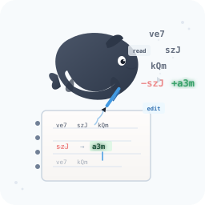
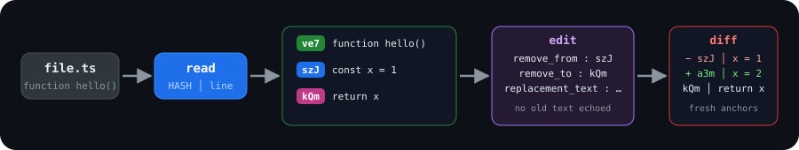

<p align="center">
  
</p>

<h1 align="center">dsh-better-edit</h1>
<p align="center">
  <strong>High-precision, hash-anchored file editing for DeepSeek Harness (dsh).</strong><br>
  Replaces fragile line numbers and token-wasting code echoes with content-addressed line hashes &mdash; 0 silent miswrites, 0 token re-reads.
</p>
<p align="center">
  <strong>English</strong> ·
  <a href="README.zh.md">简体中文</a>
</p>

<p align="center">
  <a href="#why-you-need-it"></a>
  <a href="#quick-start"></a>
  <a href="#benchmark"></a>
</p>

<p align="center">
  <a href="#why-you-need-it">Why You Need It</a> •
  <a href="#core-pillars">Core Pillars</a> •
  <a href="#quick-start">Quick Start</a> •
  <a href="#tools">Tools</a> •
  <a href="#benchmark">Benchmark</a> •
  <a href="#how-anchors-work">How Anchors Work</a> •
  <a href="#development">Development</a>
</p>

<p align="center">
  
  
  
  
  
  
</p>

<p align="center">
  
</p>

---

> **What is `dsh-better-edit`?**
> A high-precision file editing plugin for [DeepSeek Harness (`dsh`)](https://github.com/deepseek-ai) that replaces volatile line numbers and token-wasting code echoes with immutable, content-addressed 3-character line hashes (`szJ│code`).
>
> **Core Philosophy:** Local compute is free; **the model's context window is the most precious resource**. By shifting verification, snapshotting, and alignment to the host, `dsh-better-edit` slashes output tokens by 40–60%, auto-rebases external file drift (e.g., Prettier, Git), and eliminates silent miswrites without forcing full-file re-reads.

---

## Why You Need It

### The 3 Fatal Editing Traps of Autonomous Coding Agents

File editing is the #1 point of failure for autonomous agents. Traditional tools break down in three distinct ways:

| Fatal Trap in Traditional Tools | Why It Breaks Agents                                                                                                             | How `dsh-better-edit` Solves It                                                                                                                |
| ------------------------------- | -------------------------------------------------------------------------------------------------------------------------------- | ---------------------------------------------------------------------------------------------------------------------------------------------- |
| **`str_replace` Token Bleed**   | Must re-type 30+ lines of unchanged code just to change 1 line ($O(S+R)$), burning expensive output tokens (billed ~5–6× input). | **$O(R)$ Payloads**: Sends only two 3-char hashes (`anchor_from`, `anchor_to`) + replacement. Cuts output tokens by 40–60%.                    |
| **Line-Number Coordinate Rot**  | Inserting 1 line shifts all line numbers below it. Agents suffer off-by-one errors or must repeatedly re-read the file.          | **Position-Independent Anchors**: Line hashes follow content, not line coordinates. Exterior shifts auto-rebase cleanly.                       |
| **Silent Miswrites & Drift**    | Duplicate lines match the wrong function; external formatters (Prettier) or git updates cause blind overwrites or fatal errors.  | **Content-Addressed Line Verification**: Unique anchors via coprime probing; format-tolerant whitespace hashing; fail-closed reject-and-serve. |

---

## Core Pillars

### 1. 🪙 Token Economics (40–60% Context Savings)

- **$O(R)$ Edit Payloads**: The model emits only `{ "path": "...", "edits": [["a1b", "c3d", "..."]] }`, never echoing existing code.
- **Self-Serving Diffs**: Every applied edit returns fresh anchors in the post-edit diff — zero re-read roundtrips to chain edits.
- **Zero-Token Auto-Rebase**: Non-conflicting exterior shifts resolve locally without agent intervention — 0 tokens, 0 retries.
- **Atomic Multi-Item Batches**: Apply up to 32 same-file edits in one tool call; overlapping spans abort atomically (`[E_BATCH_ABORT]`) before touching disk.

### 2. 🛡️ Resistance to External Writes (Drift & Concurrency)

- **Auto-Formatter Immunity**: Strips ASCII whitespace before hashing. Prettier, Black, and ESLint format-on-save passes never rotate anchors.
- **Exterior Shift Auto-Rebase**: External edits, git checkouts, or background processes outside the edit span rebase seamlessly without agent intervention.
- **Fail-Closed Reject-and-Serve**: Contested interior spans fail closed without disk corruption and immediately return fresh on-disk rows in the error (`[E_STALE_RANGE]`, `[E_UNSERVED_RANGE]`) — recovering in **exactly 1 turn**.
- **Session-Keyed Leases**: Leases are isolated per session, preventing cross-agent race conditions or state pollution.

### 3. 🎯 Zero Silent Miswrites

- **Decoupled Line Identity**: Lines are verified against served snapshot lineage, not ephemeral line coordinates.
- **Collision-Free Anchors**: Coprime bitset probing ensures duplicate lines in a file receive distinct, unambiguous 3-character hashes.
- **No Heuristic Guessing**: Retires fuzzy matching. If an anchor cannot be unambiguously resolved, it fails closed safely.
- **Persisted Undo**: `undo_last_edit` restores exact file content, BOM, line endings, and original anchors, persisting across session restarts.

---

> _"The harness — not the model — is the bottleneck."_ — Can Bölük, [_The Harness Problem_](https://stencil.so/blog/the-harness-problem)
>
> **3 calls vs 6 · -55.8% tokens · 23/23 correctness.** Tested on realistic external-drift refactoring against OMP wrapper. Payload numbers are deterministic — see [Benchmark](#benchmark).

## Quick Start — install to verified edit in 30s

### Install (pick one)

```sh
npx @deepseek-ai/dsh plugin --profile web add github:Rianico/dsh-better-edit   # from github
npx @deepseek-ai/dsh plugin --profile web add dsh-better-edit                 # from npm
npx @deepseek-ai/dsh plugin --profile web add /path/to/dsh-better-edit       # local
```

No config. Next session runs with hashline tools. Verify:

```sh
dsh --profile <name> --dump-config   # shows "# == dsh-better-edit" layer
```

| Requirement |                                          |
| ----------- | ---------------------------------------- |
| Node        | `^22.19.0 \|\| >=24.0.0`                 |
| Profile     | `dsh` profile (`dsh plugin` creates one) |
| Backends    | sandboxed / remote `ctx.fs`              |

### See it work

`read` serves `HASH│content` — the hash _is_ the address:

```text
ve7│function hello() {
szJ│  console.log("world");
kQm│}
```

`edit` by hashes — always lands where you meant:

```json
{ "path": "src/main.ts", "edits": [["szJ", "szJ", "  console.log('hi');"]] }
```

Returns a diff with fresh anchors — next edit needs no `read`:

```text
- szJ │   console.log("world");
+ a3m │   console.log('hi');
  kQm │ }
```

**Position-free in one line:** `read 1..5` → `insert @0` → `edit 10..12` still verifies `10..12` (`resist` mode). **Multi-session honesty:** `A:10..12+1` shifts `B:20..30→21..31` → `B` passes (drift notice); `B:12..13` overlapping `A` → `E_STALE_RANGE` + fresh rows, one retry.

Batch atomically — one `edit`, up to 32 same-file ranges:

```json
{
  "path": "src/main.ts",
  "edits": [
    ["a1b", "a1b", "new line 1\n"],
    ["c3d", "c3d", "new line 2"]
  ]
}
```

One fails → none write (`[E_BATCH_ABORT]`).

> [!TIP]
> **Want proof before you install?** Upstream [23/23 battery](https://github.com/Rianico/pi-better-edit/blob/main/benchmarks/README.md) runs no LLM — stale edits are rejected every run. Same algorithm.

### Configuration

Tenancy and prompt guidance declare once, read at `agent/created`, no code change.

**Store** central by default `$DSH_HOME/plugins/dsh-better-edit/runtime/<name>-<hash8>/` (`ls`-readable + `.wsPath` sidecar). DBs are disposable caches — `rm -rf runtime/<name>-<hash8>/` is safe, rebuilt on next `read`.

```yaml
# $DSH_HOME/plugins/dsh-better-edit/config.yaml
storeDir: central # central | workspace | /abs
autoGitignore: false
undo_ttl_s: 604800 # 7d, -1 forever
storeMaxAgeS: 2592000 # 30d janitor
storeMaxTotalBytes: 524288000 # 500 MB LRU
```

Env overrides yaml (`DSH_BETTER_EDIT_STORE_DIR`, `DSH_BETTER_EDIT_AUTO_GITIGNORE`).

**Guidance per preset** — `tool:read` / `tool:edit` / `tool:undo_last_edit` are plain markdown per preset at `$DSH_HOME/plugins/dsh-better-edit/<preset>/<section>.md` (orders `130/131/133`). Delete or empty a file → default re-seeds at next boot; keep a `---` fence to blank on purpose.

## Why Hashline

**Verified against what was served.** Every resolved line checked against `read`/diff/rejection rows. Stale or unseen → `[E_STALE_RANGE]`/`[E_UNSERVED_RANGE]` + fresh `HASH│content`, retry needs no `read`. Session-scoped — sub-agent serves never validate main edits.

**Content-addressed.** `canon(line)` strips ASCII whitespace, `xxh32 → 62³=238,328` anchors. Re-inserting identical text keeps its hash; `prettier`/`eslint --fix` between edits doesn't invalidate. Unique by bitset probing — `}`/`import` repeats never collide; cap `238,328` lines (`[E_LARGE_FILE]`).

**No loop, no ritual.** No-op → `No changes made`; same no-op ×3 → `[E_NOOP_LOOP]`. Diff/echo/rejection rows count as serves — `read` is recovery, not ritual.

### Token economics

Envelope change: hoist `path`, `edits:[[from,to,text]]`, never repeat `old_string`.

| snapshot              | `str_replace` |         `edit` |   `edit` multi |   OMP per-edit |      OMP batch |
| --------------------- | ------------: | -------------: | -------------: | -------------: | -------------: |
| pinned 12-edit corpus |         1,015 | 609 **-40.0%** | 582 **-42.7%** | 590 **-41.9%** | 480 **-52.7%** |
| local snapshot        |           358 | 272 **-24.0%** | 241 **-32.7%** | 268 **-25.1%** | 180 **-49.7%** |

Percent vs `str_replace`. External row pinned corpus, `cl100k_base`; local `npm run benchmark` in upstream.

| engine          | calls | tokens |      saved | ok  |
| --------------- | ----: | -----: | ---------: | :-: |
| OMP             | **6** | 28,467 |          — | ✅  |
| hashline `edit` | **3** | 12,593 | **-55.8%** | ✅  |

Single stochastic run, `opencode-go/gpt-5.6-luna` high. [Artifact](https://github.com/Rianico/pi-better-edit/blob/main/benchmarks/results/2026-08-17-practical-token-benchmark.md).

> **Scope & honesty.** Payload deterministic; practical run stochastic. We measure **payload + round-trips**, not throughput. Retries are where the gap is largest — see [edge cases](#comparison).

## Tools

| Tool             | What it does                                                                                                |
| ---------------- | ----------------------------------------------------------------------------------------------------------- |
| `read`           | `HASH│content` with `offset`/`limit`; `[Showing N-M of T]` paging; `>200KB` lines show marker               |
| `read_skill`     | Plain text, no hashes, no serves — editing after it needs a serve                                           |
| `edit`           | `{path, edits:[[from,to,text]]}` `path:string\|null` inference, `""` deletes, atomic ≤32, verify-then-write |
| `undo_last_edit` | `{path}` restores last edit (BOM/line endings/anchors), persisted                                           |

`write` stays, but refuses an exact `HASH│` echo for same `session/path/line` before dispatch.

### Error codes

| Code                                                                                   | Meaning                                                                                                    |
| -------------------------------------------------------------------------------------- | ---------------------------------------------------------------------------------------------------------- |
| `[E_BAD_PAYLOAD]`                                                                      | Bad tuple shape (payload must be `{path, edits}` with 3-position tuples)                                   |
| `[E_STALE_ANCHOR]`                                                                     | No line (hash/retired/canon miss) / multi-line → `read`                                                    |
| `[E_BAD_ANCHOR]`                                                                       | Not bare `3-char`, or `replacement_text` carries `HASH│`/diff-preview prefixes — refused, remove and retry |
| `[E_SERVED_ECHO]`                                                                      | Copied `HASH│` from same session/path/line — refused, remove and retry                                     |
| `[E_EMPTY_RANGE]`/`[E_NOT_FOUND]`/`[E_ACCESS]`/`[E_UNSUPPORTED_FILE]`/`[E_LARGE_FILE]` | Empty guard / missing / access / binary / >238,328 lines                                                   |
| `[E_REVERSED_ANCHORS]`                                                                 | Swapped range — healed with dimmed `[USER]` notice on success, otherwise refused                           |
| `[E_BAD_ENCODING]`/`[E_DECODE_FAILED]`                                                 | Encoding / decode failed                                                                                   |
| `[E_NOT_OBSERVED]`/`[E_STALE_RANGE]`/`[E_UNSERVED_RANGE]`                              | Served-state miss — echoed fresh `HASH│content`                                                            |
| `[E_UNDO_STALE]`/`[E_UNDO_UNAVAILABLE]`                                                | Undo stale / unavailable                                                                                   |
| `[E_NOOP_LOOP]`/`[E_BATCH_ABORT]`                                                      | 3× same no-op / atomic batch fail → nothing written                                                        |

Full list in `src/` — every rejection echoes fresh rows, no `read` needed.

## Comparison

|                    | **dsh-better-edit**  | @oh-my-pi/hashline  | `str_replace` |
| ------------------ | -------------------- | ------------------- | ------------- |
| Address            | `HASH│` 3-char canon | `[path#tag]` + line | text match    |
| Whitespace-insen.  | ✅                   | ~ n/a               | ❌            |
| Duplicate lines    | ✅ unique            | ~ pos               | ❌ first      |
| Verified vs served | ✅ every line        | ~ file tag          | ❌            |
| Blind edit         | ✅ reject            | ~                   | ❌            |
| Batch atomic       | ✅                   | ✅                  | ❌            |
| Undo               | ✅                   | ❌                  | ❌            |
| Battery            | 23/23                | 10/10               | —             |

`~` partial, `—` n/a. Same lineage — patch library vs dsh tool pair; pick by seam.

**Edge cases:** wrong anchor impossible (verified), disk drift → reject+serve, shift above → nothing moves, repeats → unique/ambiguous, unseen → reject, batch → atomic. See upstream [benchmarks](https://github.com/Rianico/pi-better-edit/blob/main/benchmarks/README.md).

**Battery:** `23/23` tool, `10/10` library (upstream `npm run eval`, same algorithm).

## How Anchors Work

`canon(line)` strips ASCII whitespace → `xxHash32` → `A-Za-z0-9` 3-char (62³). Stable across `prettier`; Unicode/strings stay significant except ASCII whitespace inside strings (linter-only). `stride=62²+62+1` probes bitset → unique; cap `238,328`. Store `hash-store.sqlite` per workspace (central, honoring `XDG_CONFIG_HOME`); 7-day served TTL, janitor `storeMaxAgeS/LRU` + `wal_checkpoint`.

## How It Replaces Built-ins

dsh resolves `agent → preset → global`; built-ins live on preset. Plugin via `cordis.patch.yml`: at `agent/created` registers `read/edit` on agent layer (shadows, auto-unwinds); `write` stays with `pre-execute` guard + `post-execute` auto-read.

## Project Structure

```
dsh-better-edit/
├── src/hashline/     # hash + served core
├── src/tool-*.ts     # read / edit / undo
├── src/served-store.ts # SQLite store
├── benchmark/corpus/ # 103-line fixture
├── test/             # 108 files, 1222 tests
├── assets/           # logo + banner
└── cordis.patch.yml
```

## Development

```sh
pnpm install
pnpm typecheck   # tsc --noEmit
pnpm test        # vitest run
pnpm benchmark   # hash probe + session envelope (reads/retries/tokens)
```

## Benchmark

103-line file, 12 replacements (8×1 + 4×3/6/10/15), `cl100k_base`. `hashline` vs `str_replace` vs `oh-my-pi` `seq/batch`. Upstream is source of truth — same algorithm byte-for-byte.

| Criterion           |    hashline    | str_replace |     seq / batch      |
| ------------------- | :------------: | :---------: | :------------------: |
| `old_string` echoed |     never      | every edit  |        never         |
| 12-edit saved       |    **31%**     |     0%      |    **42% / 53%**     |
| multi-line saved    |   **29–47%**   |     0%      |      **40–53%**      |
| 5× output cost      | **~1.4× less** |     1×      | **~1.7×/~2.1× less** |
| Verified            |      100%      |    none     |       tag only       |

| Scenario      | hashline | str_replace |
| ------------- | -------: | ----------: |
| `1×8`         |      309 |         324 |
| `3–15×4`      |      393 |         691 |
| **TOTAL ×12** |  **702** |    **1015** |

Saved **313 (31%)**. Reproduce: upstream `npm run benchmark`. See [`pi-better-edit/benchmark/README.md`](https://github.com/Rianico/pi-better-edit/blob/main/benchmarks/README.md).

> **Scope & honesty.** Benchmark is **request-payload tokens** (reads cancel, replacement text identical). No transcription-failure model — real gap larger; see [edge cases](#comparison).

## Roadmap

**Current `0.7.0`:** pos-free `resist`/`strict` + retired anchor/canons/epoch, per-session `(session,path)` store, `1222` tests, `9/9` harness.

<details><summary>Next</summary>

- Keep `benchmark/run.mjs` in sync with `ADR-0013` (reads/retries/tokens per session)
- Re-check wiring vs next `dsh` (pinned `0.1.0-rc.6`)
- `README.zh.md` parity

</details>

## Contributing

See [CONTRIBUTING.md](CONTRIBUTING.md). Most valuable: more served-state edge-case tests.

## License

MIT — see [LICENSE](LICENSE).

## Acknowledgments

From Can Bölük's [_The Harness Problem_](https://stencil.so/blog/the-harness-problem). Thanks to [pi-hashline-edit](https://github.com/RimuruW/pi-hashline-edit), [pi-hashline-edit-pro](https://github.com/YuGiMob/pi-hashline-edit-pro), [pi-better-edit](https://github.com/Rianico/pi-better-edit), [@oh-my-pi/hashline](https://www.npmjs.com/package/@oh-my-pi/hashline). Reading: [hash-anchors](https://dirac.run/posts/hash-anchors-myers-diff-single-token).

---

## Star History

[](https://star-history.com/#Rianico/dsh-better-edit&Date)

---

<p align="center">
  <strong>⭐ If hashline made your agent edit better, give it a star!</strong>
</p>
