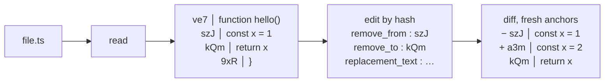
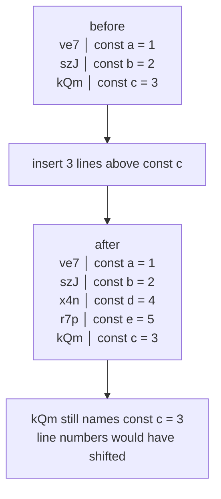

# dsh-better-edit

[English](README.md) · 中文

为 [DeepSeek Harness](https://github.com/deepseek-ai/deepseek-harness)（`dsh`）提供的基于哈希锚定的 `read` / `edit` / `batch_edit` / `undo_last_edit` 工具。文件的每一行都分配一个唯一的 3 字符哈希——即**内容地址**——编辑时按哈希定位。没有行号、没有模糊匹配、不会改错行。

这个插件围绕三件事构建：

- **省 token。** 一次编辑调用只携带 `remove_from` / `remove_to`（两个 3 字符哈希）加替换文本——从不回显被替换的文本。`str_replace` 调用则必须逐字复现被替换的文本。在一个真实文件上的 12 次编辑会话中，这可以**减少 28% 的输出 token**（多行范围达 40%）——见[基准测试](#基准测试--可复现)。
- **正确性。** 每个解析出的编辑范围都会与模型实际看到的行逐行核对。过期、从未提供或歧义的范围会在**写入任何内容之前**被硬性拒绝，并把当前范围以全新锚点的形式回显（reject-and-serve）。错行编辑不会悄悄落盘。
- **面向 Agent 的现代编辑范式。** 内容地址锚点与行号无关：编辑文件的一部分，其余行的哈希保持不变，因此连续编辑无需重新读取。模型按行**是什么**来定位，而不是按它之前在第几行。

## 核心概念



- **每行都按内容、而非位置寻址。** `read` 返回 `HASH│内容`；哈希是该行的稳定地址。行被修改则获得新哈希；行未被改动则保持原哈希，即使周围的行发生移动。



- **锚点在编辑后依然有效。** 在目标上方插入或删除行，其哈希不变——之后按该哈希 `edit` 依然能精确定位。而使用行号时，每一次上方编辑都会让下方所有内容错位，并被迫重新读取。
- **Reject-and-serve。** 过期或从未提供过的范围会被硬性拒绝，并把当前 `HASH│内容` 行回显出来，重试无需 `read`。

## 为什么不用 `str_replace`？

传统编辑工具要求模型在给出替换内容（`old_string` + `new_string`）之前，先逐 token 复述旧代码。每次编辑都要付出 `O(被替换文本)` 的 token 成本，**而且**这正是模型最容易出错的地方：最初的
[harness-problem](https://stencil.so/blog/the-harness-problem) 文章报告称，多个模型在 replace 式编辑下的补丁格式失败率高达 46–51%，改用锚定编辑后**输出 token 减少 61%**。hashline 只发送两个 3 字符锚点：

| | `str_replace` | hashline `edit` |
| --- | --- | --- |
| 请求 | `{ path, old_string, new_string }` | `{ path, remove_from, remove_to, replacement_text }` |
| 被替换文本 | 逐字复现 | 从不发送 |
| 范围校验 | 无（取第一个匹配） | 每一行都与已提供状态核对 |
| 文件已过期 | old_string 可能仍然匹配——并命中错误的出现位置 | 被拒绝并回传新锚点（`E_RANGE_STALE`） |
| 文本有歧义 | 静默取第一个匹配 | 边界锚点需校验——调用 `read` 获取新锚点 |

## 基准测试 —— 可复现

`benchmark/run.mjs` 在同一份 103 行文件上、用相同的 12 组替换（8 个单行、4 个 3/6/10/15 行多行），以固定的 `js-tiktoken` `cl100k_base` 词表测量两种模式的模型侧 token 成本：

| 场景 | 行数 | hashline | str_replace | 节省 | % |
| --- | --- | --- | --- | --- | --- |
| 单行 ×8 | 1 | 311 | 314 | 3 | 1% |
| 多行 ×4 | 3–15 | 390 | 655 | 265 | **40%** |
| **合计 ×12** | | **701** | **969** | **268** | **28%** |

读文件流量对两种工具完全相同，可抵消。以上是模型的**输出** token，按输入的约 5-6 倍计费——按 5 倍计，hashline 的实际成本**低约 1.4 倍**。节省随被替换文本的规模增长：短单行接近持平（锚点开销大致抵消一行 `old_string`），多行范围为 25–46%。

自行复现——确定性、自带自检、无需构建步骤：

```sh
npm install        # 安装 js-tiktoken（固定版本）
npm run benchmark  # node benchmark/run.mjs
```

完整的测量方法、结果与诚实的局限说明（基线没有建模的部分）见 [`benchmark/README.md`](benchmark/README.md)。

## 用法

1. 读取文件：

```text
ve7│function hello() {
szJ│  console.log("world");
kQm│}
```

1. 按哈希编辑某行：

```json
{
  "path": "src/main.ts",
  "remove_from": "szJ",
  "remove_to": "szJ",
  "replacement_text": "  console.log('hi');"
}
```

1. 继续编辑。未触碰行的锚点依然有效；编辑后的 diff 与 `write` 之后的自动读取会交给你新锚点。`read` 是按需恢复，而不是每次编辑前的例行公事。

### read 工具

`read` 返回一个文本文件，每一行都以 `HASH│内容` 为前缀（哈希 = `A-Za-z0-9` 中的 3 个字符）。参数：`offset`（1 起始的行号）、`limit`（最大行数）。分页输出以 `[Showing lines N-M of T. Use offset=… to continue.]` 结尾。超过 200KB 的行会显示为一个标记并附带 `sed` 检查提示——哈希锚点需要完整行。

### edit 工具

| 字段 | 含义 |
| --- | --- |
| `path` | 要编辑的路径（相对会话 cwd；绝对路径亦可）。 |
| `remove_from` | 要删除的第一行的裸 3 字符哈希。 |
| `remove_to` | 要删除的最后一行的裸 3 字符哈希。 |
| `replacement_text` | 替换文本；`""` 表示删除该范围。 |

该工具会对解析出的范围内**每一行**与模型实际看到的内容逐一核对。范围内某行自被提供以来在磁盘上发生了变化，就会被 `[E_RANGE_STALE]` / `[E_RANGE_UNSERVED]` / `[E_RANGE_UNVERIFIED]` 硬性拒绝，并把当前范围以全新锚点的形式回显（reject-and-serve）。diff 窗口之外行的锚点通过 `read` 恢复——这是文档化的按需恢复方式。

### batch_edit

在单个原子调用中完成多次编辑：`{ edits: [{ path?, remove_from, remove_to, replacement_text }, …] }`。全有或全无——任何一项失败都会使整个批次被拒绝且不写入任何内容，失败项的当前范围会以新锚点的形式回显。最多 32 项。

### undo_last_edit

`{ path }` 撤销该文件上一次 hashline 编辑，仅当文件仍与存储的编辑后内容一致时才生效。之后发生的外部写入会清除历史记录，而不是被覆盖。撤销在重启后依然有效（存储于哈希库中）。

## 如何替换内置工具

dsh 的工具注册表按作用域解析：agent 看到的是 `agent → preset → global`，且**自身**层总是优先。内置的 `read`/`edit` 位于 agent-preset 层，因此普通的全局注册无法替换它们。本插件：

1. 通过其 `cordis.patch.yml` bundle 补丁作为宿主层 Cordis 插件挂载。
2. 在 `agent/session-start` 时，将 hashline 工具**以及** `tool:read` / `tool:edit` 提示词片段注册到 agent 自身的作用域层——从而为该 agent 遮蔽 preset 的内置工具，并在 agent 销毁时自动解除。
3. 保留内置的 `write`，但通过一个作用域内的 `tools/post-execute` 监听器把 hashline 自动读取附加到 write 结果之后。

## 安装

从 npm：

```sh
dsh plugin --profile <name> add dsh-better-edit
```

从本地源码：

```sh
dsh plugin --profile <name> add /path/to/dsh-better-edit
```

该 profile 的下一个会话将带着 hashline 工具运行。验证该层是否生效：

```sh
dsh --profile <name> --dump-config   # 会显示 "# == dsh-better-edit" 层
```

### 环境要求

- Node `^22.19.0 || >=24.0.0`（dsh 的要求；存储使用 `node:sqlite`）
- 一个 dsh profile（首次使用 `dsh plugin` 时初始化）

## 存储

哈希快照、已提供状态行与撤销历史存放在一个 SQLite 库中，**与被编辑的工作区放在一起**——每个会话 cwd 一个库：

- `<workspace>/.dsh_better_edit/hash-store.sqlite`

不同工作区中的并行会话各自持有独立的库（会话 cwd 会随每次工具调用传递），因此一个项目的锚点与撤销历史不会泄漏到另一个项目。在工具调用之外（测试、预览）会回退到共享的 DeepSeek Harness 主目录（`$DSH_HOME/plugins/dsh-better-edit/hash-store.sqlite`）。

7 天 TTL 会清理已提供的行；启动时清理缺失文件的快照。损坏的库会被隔离并自动重建。迁移到按工作区布局**不会**迁移共享主目录中的早期撤销历史——把 0.1.2 之前的撤销记录视为已丢失。

## 错误码

| 代码 | 含义 |
| --- | --- |
| `[E_ACCESS]` | 文件存在但工具不可读/不可写。 |
| `[E_AMBIGUOUS_ANCHOR]` | 一个哈希匹配当前多行；调用 `read` 获取新锚点。 |
| `[E_BAD_OP]` | 范围结束先于范围开始（首尾颠倒时会自动纠正）。 |
| `[E_BAD_REF]` | `remove_from`/`remove_to` 不是裸 3 字符哈希。 |
| `[E_BAD_SHAPE]` | 请求/字段形态错误（未知字段、缺少 path、非字符串文本等）。 |
| `[E_BARE_HASH_PREFIX]` | `HASH│` 前缀被粘贴进 `replacement_text`（自动纠正）。 |
| `[E_BATCH_ABORT]` | 批次内某项失败；整个批次被拒绝，未写入任何内容。 |
| `[E_FILE_TOO_LARGE]` | 文件超过 hashline 行数上限；请改用 `write` 或其他方式。 |
| `[E_INVALID_PATCH]` | diff 预览标记被粘贴进 `replacement_text`（自动纠正）。 |
| `[E_NOOP_LOOP]` | 完全相同的编辑反复不产生任何变化；再次提交会被拒绝。 |
| `[E_NOT_FOUND]` | 文件不存在。 |
| `[E_NOT_OBSERVED]` | 该文件在本会话中尚未被观察（先读后写策略）；请先调用 `read`。 |
| `[E_NOT_TEXT]` | 路径是目录、二进制或非 UTF-8 文件；hashline 只能编辑文本。 |
| `[E_RANGE_STALE]` | 某行自被读取以来在磁盘上发生变化；范围以全新锚点回显。 |
| `[E_RANGE_UNSERVED]` | 范围内包含从未提供给模型的行。 |
| `[E_RANGE_UNVERIFIED]` | 边界锚点无法对照已提供状态验证。 |
| `[E_STALE_ANCHOR]` | 锚点不再能解析；调用 `read` 获取新锚点。 |
| `[E_UNDO_STALE]` | 无法撤销：编辑之后文件被修改（或删除）。 |
| `[E_UNDO_UNAVAILABLE]` | 撤销历史无法持久化；编辑未被应用。 |
| `[E_WOULD_EMPTY]` | 编辑会把非空文件清空；请用 `write` 清空。 |

## 灵感与血统

哈希锚定编辑源于 Can Bölük 的
[*The Harness Problem*](https://stencil.so/blog/the-harness-problem)（Can Bölük），它证明了瓶颈在于 harness 而非模型，并且锚定编辑优于搜索替换。本项目是以下作品的 dsh 移植：

- [**pi-hashline-edit**](https://github.com/RimuruW/pi-hashline-edit)（RimuruW）——引入 3 字符哈希与冲突消解的原创 pi-coding-agent 扩展。
- [**pi-hashline-edit-pro**](https://github.com/YuGiMob/pi-hashline-edit-pro)（YuGiMob）——本仓库 hashline 核心所移植自的加固版 fork。
- [**pi-hashline-edit-lsz**](https://github.com/Rianico/pi-hashline-edit-lsz)——本项目所跟随的自维护 fork。hashline 核心逐字节移植；工具层基于 dsh 的插件 API 重写。

延伸阅读：[Hash anchors + Myers diff + single-token anchors（dirac.run）](https://dirac.run/posts/hash-anchors-myers-diff-single-token)（关于编辑调用 O(S+R) → O(R) 节省的设计评论）以及一个独立的 [hashline 与 replace 对比基准测试](https://nwyin.com/blogs/hashline-vs-replace-edit-bench.html)。

## 开发

```sh
npm install
npm run typecheck   # tsc --noEmit
npm test            # vitest run
npm run build       # tsc → lib/
npm run benchmark   # 可复现的 token 成本基准测试（benchmark/）
```

测试套件移植自 pi-hashline-edit-lsz（615 个测试），通过本地文件系统桥接直接驱动 dsh 工具构建器。

## 许可证

MIT——见 [LICENSE](LICENSE)。移植自 pi-hashline-edit-lsz（MIT），其本身带有 RimuruW 与 YuGiMob 的上游版权声明。
