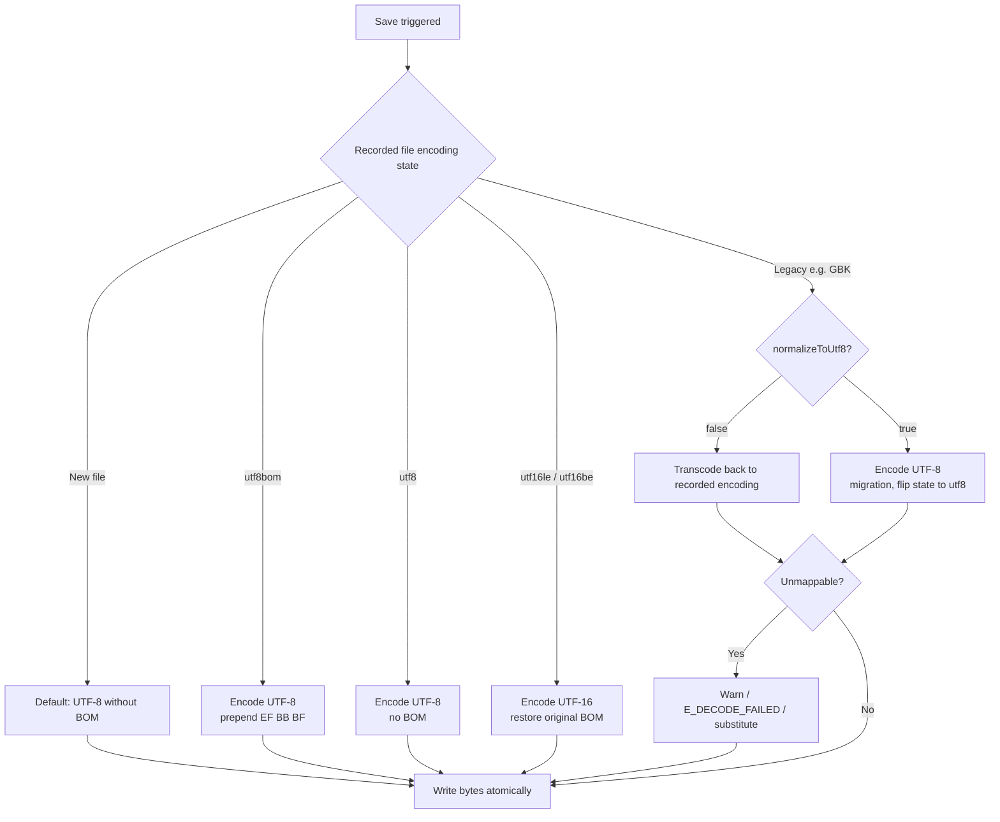

# ADR-0012 — VS Code Encoding Model for Non-UTF-8 Text

Date: 2026-08-30
Status: accepted (grill-with-docs, Q1–Q12)
Related: #34 `read/edit reject non-UTF-8 text files`, `docs/specs/issue-34-encoding-research.md`, CONTEXT.md `File Encoding`

## Context

`read/edit` on GBK/CP1251/Shift-JIS fails with `[E_NOT_TEXT] Path is not a readable UTF-8 text file` — the file is text, just not UTF-8. `ctxFsIO.readText` forwards DSH `FS_NOT_TEXT` (provider's `TextDecoder("utf-8",{fatal:true})` + NUL-sample gate) with no hint, while `localIO` permissively shows `�` and normalizes. DSH `dsh-fs` is `0.1.0-rc.6` (developer preview, breaking changes allowed) and text-only by contract (`Binary-safe mutations remain deferred`).

The proposal: adopt VS Code's flow — deterministic-first detection, state-at-open / invert-at-save round-trip, manual override, off-by-default guessing — adapted for the harness's agent tool surface.

## Decision

Adopt the VS Code model verbatim, with 3 harness deltas: model-assisted guessing instead of `jschardet`, top-3 scored previews, and `read_skill` encoding-without-served semantics.

### Read flow

```mermaid
flowchart TD
    A[Read raw bytes via readBytes] --> B{BOM?}
    B -->|EF BB BF| C[utf8bom]
    B -->|FF FE| D[utf16le]
    B -->|FE FF| E[utf16be]
    B -->|no BOM| F{strict UTF-8 fatal:true}
    F -->|valid| G[utf8]
    F -->|invalid| H{autoGuessEncoding?}
    H -->|false| I[E_NOT_TEXT + Top-3 guesses<br/>+ hint + manual read encoding]
    H -->|true| J[score allowlist via chardet+iconv-lite<br/>printable + scriptRange + confidence]
    J --> K[top-3 previews (chardet Top-3 when conf>=45 else heuristic Top-3)<br/>50-char smart slice, always pushed]
    K --> L[model picks encoding]
    L --> M[read encoding canonical]
    C --> Z[record file encoding state<br/>targetKey→encoding,hasBOM,version]
    D --> Z
    E --> Z
    G --> Z
    I --> Z
    M --> Z
    Z --> N[hash internal UTF-8 view<br/>serve HASH│content]
```

*Deterministic-first:* BOM sniff always precedes strict UTF-8, which always precedes guessing. Probabilities are last resort, gated by `autoGuessEncoding` (default `false`, mirrors VS Code) for **auto-decode**, but **Top-3 candidates are always pushed** — as `E_NOT_TEXT` details when `autoGuessEncoding:false` and as `[Auto-guessed: enc, candidates: …]` second `ContentBlock` footer when `true` (probabilistic encodings always surfaced, never hidden).

*Model-assisted top-3 (chardet + heuristic):* Always run `chardet` (maintained, MIT, 22KB) as Top-3 enhancer; `autoGuessEncoding:true` auto-decodes via `chardet` Top-1 when `confidence>=45`, otherwise heuristic (`iconv-lite` score without `�` + printable + script-range + cjk*5/hiragana*8). Top-3 (50-char smart slice around first non-ASCII, ~36 tokens) is **always surfaced** — in `E_NOT_TEXT` (`Top-3 guesses: … Try read({encoding})`) or in the auto-guess footer (`[Auto-guessed: enc conf, candidates: …]`). The model re-calls `read({encoding})` from that list only; `encoding` is canonical case-insensitive enum (`utf8`/`gbk`/`cp1251→windows-1251`, hyphens/underscores stripped). Missing `config.yaml` keys are complemented with defaults on next `loadConfig()` (see `store-config.ts` complement).
### Write flow



*State at open, invert at save:* `file encoding state` `{encoding, hasBOM, lineEnding}` is recorded at open and inverted on save — never re-derived. Drift-aware: if `stat.version` changed, discard stale `file encoding state` and re-run deterministic `BOM→UTF-8` before any guess. Session-TTL (like `served state`), not cross-restart.

*Defaults favor modern convention:* New files `utf8` without BOM; BOM only ever preserved, never added spontaneously. Failure explicit — undecodable/mojibake surfaces as `E_NOT_TEXT`/`E_DECODE_FAILED` or `details.candidates` warning, never silent rewrite.

### Tool surface vs VS Code

| VS Code | BetterEdit | Delta |
| --------- | ------------ | ------- |
| `files.autoGuessEncoding` off | `autoGuessEncoding: false` + `DSH_BETTER_EDIT_AUTO_GUESS_ENCODING` | Verbatim, flat bool in `store-config.ts` |
| Status bar + `Reopen with Encoding` / `Save with Encoding` | `read({encoding?})` + `write({encoding?})` (canonical enum, `E_BAD_ENCODING` on unknown) | Agent has no status bar — tool params are the hatch |
| `jschardet` probability | heuristic score + model picks from top-3 | No 200 KiB dep, agent aligns with visible mojibake |
| Buffer is owner | DSH provider owns when available; else plugin `Map<targetKey,…>` invalidated by `FsVersion` | Hybrid per Q1 |

`read_skill` (reference read) follows the same capture path for encoding (so GBK `SKILL.md` renders), **records `file encoding state` but never `served state`** — it can feed `write` (full replace, round-trips when `normalizeToUtf8:false`) but cannot authorize `edit` anchors (`E_RANGE_UNSERVED` still requires a hashed `read`).

Errors: `E_NOT_TEXT` (initial, with `candidates` when guessing), `E_BAD_ENCODING` (unknown `encoding` param), `E_DECODE_FAILED` (bytes undecodable under requested charset).

## Considered Options

- **Plugin-local `readBytes+jschardet+re-encode` shim (#34 as-written)** — rejected as system seam ownership violation; duplicates `file-type`/NUL/`maxBytes` guard, 200 KiB + false positives on <1 KiB, diverges `dsh read` vs `better-edit read`, needs version-persisted `Map`.
- **DSH provider blindly normalizes to UTF-8** — rejected for GBK-locked repos (one-way migration without `normalizeToUtf8` opt-in).
- **Hardcoded 5 encodings + 200-char previews** — superseded by configurable allowlist + 50-char smart slice + scoring (your Q7 probe).
- **`read_skill` strict UTF-8 only** — superseded by your Q12 follow-up: capture encoding too, just never serve.

## Consequences

- `CONTEXT.md` adds `### File Encoding` glossary: `file encoding state`, `decoding error`≠`detection error`, `autoGuessEncoding`, `manual override`; refines `read_skill`.
- `src/store-config.ts` adds `autoGuessEncoding: false`, `normalizeToUtf8: false`, `supportedEncodings?: string[]` (flat) + env adapters + `DEFAULT_CONFIG_YAML` docs; `loadConfig()` `mtimeMs` cache extended.
- `src/encoding.ts` (new, pure) + `src/fs-bridge.ts` fallback `Map` + `tool-read.ts`/`tool-write.ts` `encoding` params follow in implementation PRs.
- `FsWriteOutcome.before` becomes `string` (not `null`) for permissively decoded legacy files; large legacy files (`>readBytes maxBytes` ~10 MiB) still `E_FILE_TOO_LARGE` v1.
- Upstream proposal: enrich `FS_NOT_TEXT` `cause` + permissive `readWholeText` normalization — complementary, not blocking.

## References

- Issue #34 body + `docs/specs/issue-34-encoding-research.md` (dsh-fs 13 primitives, `fsio.ts:readWholeText`, `docs/subsystems/filesystem.md` seams)
- Previous ADRs 0002/0005 (whitespace-insensitive anchors, hash-echo guard) — anchors hash internal UTF-8 view only
