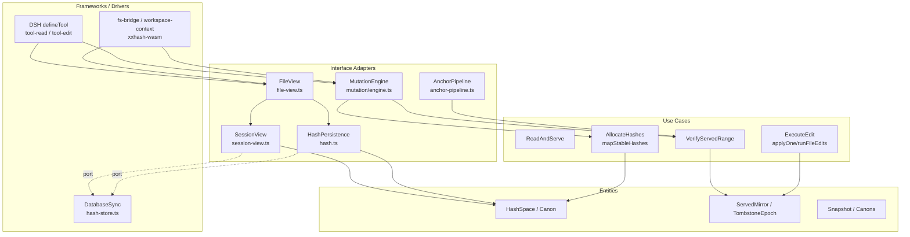

# Architecture — ADR-0013 Pos-free Round-trip Optimization

> ADR: `docs/adr/0013-pos-free-roundtrip-optimization.md` · Issue: [#31](https://github.com/Rianico/dsh-better-edit/issues/31) · PR: [#41](https://github.com/Rianico/dsh-better-edit/pull/41) · Branch: `fix/issue-31-freed-anchor-tombstones`

## 1. Goal

Keep the extension **position-free for single-thread** (serial `read → edit*` per `sessionKey`) to reduce round trips, while guaranteeing correctness under concurrency by **fallback to `pos + tombstone + canon`**. The whole-span variant `S@3 reborn @3` after `other|cards` swap shows `pos` alone is insufficient; `tombstone` per epoch is load-bearing.

Project contracts from `CONTEXT.md` preserved: `anchor philosophy` (position-independent, ASCII-whitespace strip `ADR-0002`), `model–tool boundary`, `reject-and-serve`, `served state` mirror, `orphaned serve` healing (`ADR-0004`).

## 2. Clean Architecture — Layers & Dependency Rule

**Dependency Rule:** dependencies point **inward**. Inner layers know nothing of outer. Outer layers depend on inner via **interfaces/ports**.

```text
Frameworks/Drivers → Interface Adapters → Use Cases → Entities
```

### 2.1 Entities (enterprise business rules, no I/O)

| Entity | Invariant | File |
| --- | --- | --- |
| `HashSpace` | `HASH_SPACE=62^3`, `HASH_LEN=3`, `probe stride = 63^2+63+1`, unique per file, `canon=line.replace(/[ \t\r\n]+/g,"")` (`ADR-0002`) | `src/hashline/hash-assign.ts` (pure part) |
| `Anchor` | `HASH_SEP=│`, `HASH_RE`, content-derived, never fuzzy-matched | `src/hashline/hash-assign.ts` |
| `ServedMirror` | `served: (hash \| null)[]` per `(session,path)` is model's knowledge; `orphan` = hash at wrong slot | `src/session-view.ts` (`_mergeServedRows`) |
| `TombstoneEpoch` | `tombstone:Set<hash>` per `(session,path)` since last **full** `read`; `used=bitset(oldHashes)∪bitset(tombstone)` | `src/hash-store.ts:served.retired`, `src/session-view.ts` |
| `Snapshot` | `path+checksum+lineCount -> hashes[]` global last-writer-wins cache | `src/hash-store.ts:snapshots` |
| `Canons` | `hash->canon` map for `S@3==S@3` whole-span detection; `canon==` alone not enough, need `tombstone` | `src/hashline/hash-assign.ts` (`hashToCanon`) + `served.canons` (proposed) |

### 2.2 Use Cases (application business rules)

| Use Case | Interactor | Input/Output Port |
| --- | --- | --- |
| `ReadAndServe` | `readView` + `readAndServe` | In: `path, offset/limit, encoding, sessionKey` → Out: `hashes+servedRows` |
| `VerifyServedRange` | `verifyServedRange` | In: `served, fileHashes, fileLines, start/endHash, tombstone, canons, strictPos?` → Out: `void` or `E_RANGE_*` + `servedRows` |
| `AllocateHashes` | `lineHashesPure` / `mapStableHashes` | In: `content, previous{hashes,removed}, reserved/tombstone` → Out: `hashes[]` |
| `ExecuteEdit` (single/batch) | `applyOne` / `runFileEdits` | In: `HEdit, hashes, served, reservations` → Out: `result+range+removedHashes` |
| `HealOrphan` | `_mergeServedRows` (eager) + candidate enumeration (lazy) | `ADR-0004` |
| `ComputeDrift` | `scanDrift` | `drift notice` (user-facing per `ADR-0006`) |

### 2.3 Interface Adapters

| Adapter | Role | File |
| --- | --- | --- |
| `FileView` | normalize → hash → render → truncate → `served` selection | `src/file-view.ts` |
| `HashPersistence` | `HashSnapshotIO` (`get/upsert`) — port for Entities | `src/hashline/hash.ts` |
| `ServedPersistence` | `ServedPersistence` (`getServed`, `getAnchorReservations`, `getRetiredAnchors`, `upsertRetiredAnchors`, `clearRetiredAnchors`) | `src/hash-store.ts`, `src/session-view.ts` |
| `MutationEngine` | `applyOne`, `runFileEdits`, `persistUndoAndWrite` | `src/mutation/engine.ts`, `src/mutation.ts` |
| `AnchorPipeline` | `resEdit → swapReversed → stripBare → stripDiff → valEdit → verifyServed → resToSpan` (sealed seam) | `src/hashline/anchor-pipeline.ts` |

### 2.4 Frameworks/Drivers (outermost)

`@deepseek-ai/cordis` `defineTool` (`src/tool-read.ts`, `src/tool-edit.ts`, `src/tool-undo.ts`), `DatabaseSync` (`node:sqlite`), `fs-bridge.ts` (`FileIO`), `workspace-context.ts` (`execSessionKey`, `withWorkspace`), `xxhash-wasm`.

> `hash.ts` stays **pure** with injected `HashSnapshotIO`; `hash-assign.ts` stays **pure** with `reservedHashes` param — no `loadHashStore()` inside Entities/Use Cases. This satisfies `ADR-0004` "hash-layer detection rejected".

## 3. Mermaid — Dependencies Point Inward



## 4. PR #41 — What Got Right vs Outdated (pre-discussion)

PR #41 is built on the first single-agent tombstone understanding before the pos-free design.

**Got right (reusable):**

* Drops `removedByContent` queue in `mapStableHashes` — correct single-agent lifecycle gap.
* Blocks freed hashes via `used=bitset(oldHashes)∪bitset(blocked)` where `blocked=reserved∪removed` (`src/hashline/hash-assign.ts`).
* Migrates `served` schema `ALTER TABLE served ADD COLUMN retired TEXT` preserving `hashes`, invalidates pre-fix `snapshots`+`undo` that may contain rebound anchors (`src/hash-store.ts:buildStore`).
* Fixes `lineHashes` to reject cached `hashes` containing `retiredHashes` and to reserve during `lineHashesPure`/`mapStableHashes`.
* Retires anchors on `edit`/`batch`/`partial read displacement` and clears on `full read` (`src/session-view.ts:retireAnchors`, `recordServed` `isFullRead` check, `recordServedTruncated`).

**Outdated vs ADR-0013 (needs update):**

* **No epoch `snapshotId`** (`ino|mtime|size|checksum` via `file-view.ts:fileSnap`). PR #41 uses `isFullRead = rows.length==fullReadHashes.length && rows.every(pos==index)` — no file-version comparison, so `insert @0` before `served 1..5` still moves `served` and is healed as `displacedHashes` retirement, not recognized as exterior drift that should stay pos-free.
* **No `canons TEXT` column.** Stores only `hashes+retired`, no `canon_at_serve` parallel array. Whole-span `S@3==S@3` with same `canon` passes `hash==` check; `canon` check is missing.
* **Global `reserved=served∪retired` across *all* sessions per path** (`getAnchorReservations(path)` scans `SELECT ... WHERE path=?`). ADR-0013 requires **per-`(session,path)` tombstone epoch** since last full `read`; global reservation blocks reuse for *all* sessions until any session does a full read — prematurely cleared and violates per-session isolation. `file snapshots` stays global last-writer-wins, but `tombstone` must be per-session.
* **No `pos` fallback.** No `from==startLine-1` strict check, no `support_concurrency` config. Cross-session `S@2->7` shift with isolated `tombstone` stays silent (desired for single-thread, needs `strict` for concurrency).
* **No `pos-free` guarantee for non-overlapping** — PR #41 still retires `displacedHashes(Current,Updated)` on every `recordServed`/`recordServedTruncated`, so `A:10..12 +1` forever retires `B:20..30` hashes as `displaced`, even though exterior `insert` should be allowed.
* **Whole-span `S@3 reborn @3`** not covered without `canons`+`tombstone` per epoch (PR #41's `reserved` would block it only if same `path` and any session still holds `S`, but same-pos rebind with `reserved` across all sessions may over-block).
* **Undo restores with `restoredHashes` via `blockedRestoreHashes = reserved∪currentHashes`** — close to ADR-0013's `(tombstone-restored)∪(cur-restored)` but without `canons` and with global `reserved`.

## 5. Curated Architecture (ADR-0013)

Keep `pos-free` for `resist` (default), fallback to `strict` for `concurrency:true`.

* **Read full:** store `epoch={snapshotId, servedHashes, servedCanons}` per `(session,path)` in `hash-store.ts:served` (`hashes TEXT, canons TEXT, tombstones TEXT, reported TEXT`). Partial read merges via `_mergeServedRows` without clearing epoch, but `displacedHashes` only retires when `hash` actually displaced, not on exterior shift.
* **Edit `verifyServedRange`:** `curId=fileSnap(path)` vs `epoch.snapshotId` → if `==` skip `pos`; else `candidates { hash== && len== }` filtered by `tombstone`, then `servedCanons[from+k]==canon(fileLines[startLine-1+k])` else `E_RANGE_STALE`. No `from==pos` in `resist`. `strict` adds `from==startLine-1 && to==endLine-1` behind config.
* **Allocate:** `hash-assign.ts:mapStableHashes(..., tombstone)` with `used=bitset(oldHashes)∪bitset(tombstone)`; drop `removedByContent`; `lineHashesPure(..., reserved)` also respects per-session `tombstone`. `hash.ts:lineHashes` threads `reservedHashes, retiredHashes` from `loadAnchorReservations` per session, not global.
* **Non-overlapping forever pos-free:** `A:10..12 +1` shifts `B:20..30->21..31`; `B`'s `served 20..30 == file 21..31` still `candidates==1` → pass, `tombstone` not touched (no `removed` in that range).

## 6. Reuse Verdict per File (vs PR #41)

| File | Verdict | Reason | Severity |
| --- | --- | --- | --- |
| `src/hashline/hash-assign.ts` | **reusable** — needs update | Drop `removedByContent`, add `tombstone` param is correct; needs `markHashUsed(tombstone)` already in PR #41, keep. Needs `canon` storage not here — allocation layer stays hash-only. | — |
| `src/hashline/hash.ts` | **reusable** — needs update | `reservedHashes`/`retiredHashes` params correct; needs to switch from `getAnchorReservations(path)` global to `getTombstone(session,path)+getServedCanons(session,path)` per-session epoch. | medium |
| `src/hash-store.ts` | **needs update** | `retired TEXT` migration preserving `hashes` correct; must add `canons TEXT` + `tombstones TEXT` per `(session,path)` epoch, change `servedAllForPath(path)` global scan to per-session `getServedCanons(session,path)` + `getTombstone(session,path)`. Remove global `reserved = served∪retired` scan. Invalidate `snapshots` on `canon` upgrade already done. | high |
| `src/session-view.ts` | **needs update** | `retireAnchors`, `displacedHashes`, `isFullRead` logic correct single-agent; must make `displaced` not retire exterior shift (only when `hash` displaced within served range), and persist `canons` atomically with `hashes` in `recordServed`. | high |
| `src/file-view.ts` | **reusable** | `reservedHashes`/`retiredHashes` threading via `ReadNormOptions`/`ReadViewOpts` is correct adapter pattern; keep but wire per-session `tombstone` instead of global `reserved`. | low |
| `src/mutation/engine.ts` | **reusable** — needs update | `reservedHashes` into `applyOne`/`runFileEdits` and `newlyRetired` accumulation correct; needs per-session `loadAnchorReservations(session,path)` not global, and `lineHashes` call must pass `canons` epoch. | medium |
| `src/hashline/anchor-pipeline.ts` | **needs update** | `verifyServedRange` already has `isHealed`/`canon` healing and `E_RANGE_*` taxonomy; must add `servedCanons` parallel array param, `tombstone` filter on candidates, `epoch snapshotId` early-exit, and `support_concurrency` strict `pos` gate. | high |
| `src/read-and-serve.ts` | **reusable** | `loadAnchorReservations` before `readView` + `recordServed(..., view.hashes)` full-read detection correct; needs to pass `canons` too. | low |
| `src/tool-undo.ts` | **needs update** | Fresh `restoredHashes` via `blockedRestoreHashes` correct; needs per-session `tombstone` update `(tombstone-restored)∪(cur-restored)` already, but with global `reserved` it over-blocks `currentOnlyAnchor`. Switch to per-session. | medium |
| `test/core/hashline-stable-mapping.test.ts` | **reusable** | Flipped expectations (`fresh hash not removed`) already match ADR-0013. | — |

## 7. Residual Risks

* `served.canons` migration without invalidating `served.hashes` — old rows lack `canons`, `verifyServedRange` `getCanonForHash` fallback (`hashToCanon` in-memory) may miss. Mitigate by `ALTER TABLE served ADD COLUMN canons TEXT` with `null` healing via `canon(fileLines[pos])` lazy fill on first `recordServed`.
* Per-session `tombstone` grows without bound if session never does full `read` (`SERVED_TTL_MS` sweep via `pruneServedOlderThan` covers it, but tune).

## 8. Next Steps (no code edit in this task)

1. Implement `hash-store.ts:served (hashes, canons, tombstones)` per-session epoch + `fileSnap` epoch.
2. Update `hash-assign.ts`/`hash.ts` to thread per-session `tombstone`.
3. Update `anchor-pipeline.ts:verifyServedRange` to `epoch` + `candidates hash==` + `tombstone` filter + `canon==` + `strict` flag.
4. Add `config.support_concurrency` and flip property tests.
